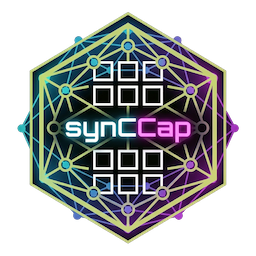
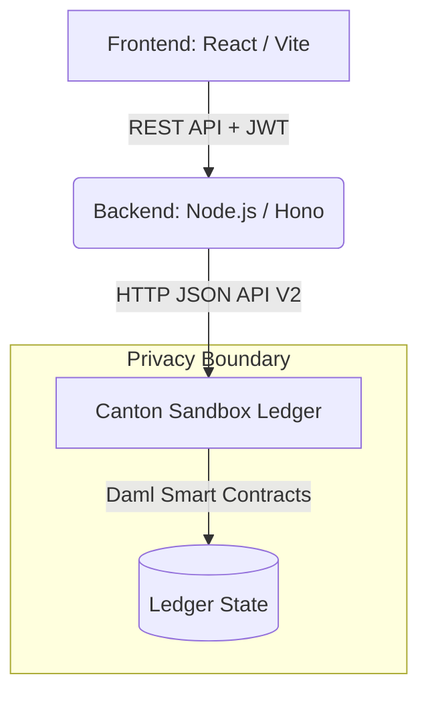

<div align="center">
  
  <h1>synCCap: Private DeFi & Capital Markets for Real-World Assets</h1>
</div>

> **Track Focus:** Private DeFi & Capital Markets, TradeFi, RWA & Tokenized Assets

**synCCap** is an institutional-grade decentralized application that tokenizes the world's most strategic real-world asset (RWA): **High-End Semiconductor Foundry Capacity**. 

Built on the **Canton Network** using **Daml**, synCCap provides an OTC Dark Pool for secondary market trading of capacity commitments. It strictly enforces sub-transaction privacy to guarantee that highly sensitive commercial data—such as a primary buyer’s cost basis and penalty rates—are mathematically concealed from secondary buyers and market competitors.

---

## 🏗 Architecture & Stack



*   **Smart Contracts (Phase 1):** Pure Daml. Defines templates for `CapacityAsset`, `CapacityFinancials`, `CapacityAssetLock`, `TransferRFQ`, and `PenaltyAgreement`.
*   **Backend (Phase 2):** Node.js / TypeScript. Uses Hono to expose a REST API. Wraps the Canton JSON API V2 and handles JWT Sandbox authentication.
*   **Frontend (Phase 3):** React + Tailwind CSS + Lucide Icons. Provides role-based views (Manufacturer, Primary Buyer, Secondary Buyer) to visually demonstrate Canton's privacy guarantees.

---

## 🚀 How to Run the Stack (Local Development)

You will need three terminal windows to run the complete stack.

### Step 1: Start the Canton Ledger Sandbox
Run the Daml sandbox to simulate the Canton Network and expose the Ledger API on port 7575.
```bash
# In Terminal 1 (Root directory)
dpm build
dpm sandbox --json-api-port 7575 --dar .daml/dist/synccap-v3-0.1.0.dar
```

### Step 2: Start the Backend REST API
The backend acts as an integration layer, translating HTTP REST calls into Daml Ledger API commands.
```bash
# In Terminal 2
cd backend
npm install
npm run dev
```
*(The backend will start on `http://localhost:3000` by default. API Docs are available at `http://localhost:3000/swagger`)*

### Step 3: Start the React Frontend
Launch the UI to interact with the ledger.
```bash
# In Terminal 3
cd frontend
npm install
npm run dev
```
*(The frontend will start on `http://localhost:5173`. Open this URL in your browser.)*

---

## 🔒 The Privacy Guarantee

Why use Canton instead of a public chain (like Ethereum) or a standard database?
1. **Public Chains leak Business Intelligence (BI):** If Apple resells capacity to Qualcomm on Ethereum, Qualcomm can see exactly how much Apple originally paid TSMC. This is unacceptable for enterprise supply chains.
2. **Centralized DBs lack Trustless Settlement:** A standard database requires all parties to trust the DB operator. Canton provides atomic, trustless cryptographic settlement without a centralized intermediary.
3. **Canton's Solution:** Canton allows Apple to prove to Qualcomm that the asset is valid and the transfer is authorized, *without* revealing the original `costBasisPerWafer` to Qualcomm.

---

## 📄 License
This project is licensed under the Apache 2.0 License.
