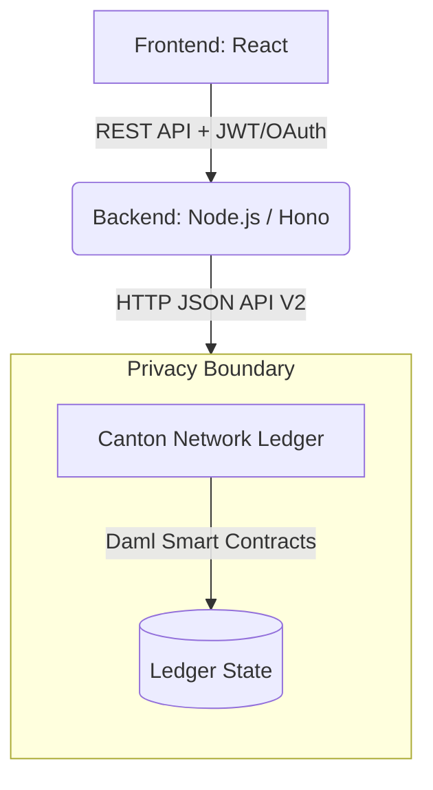
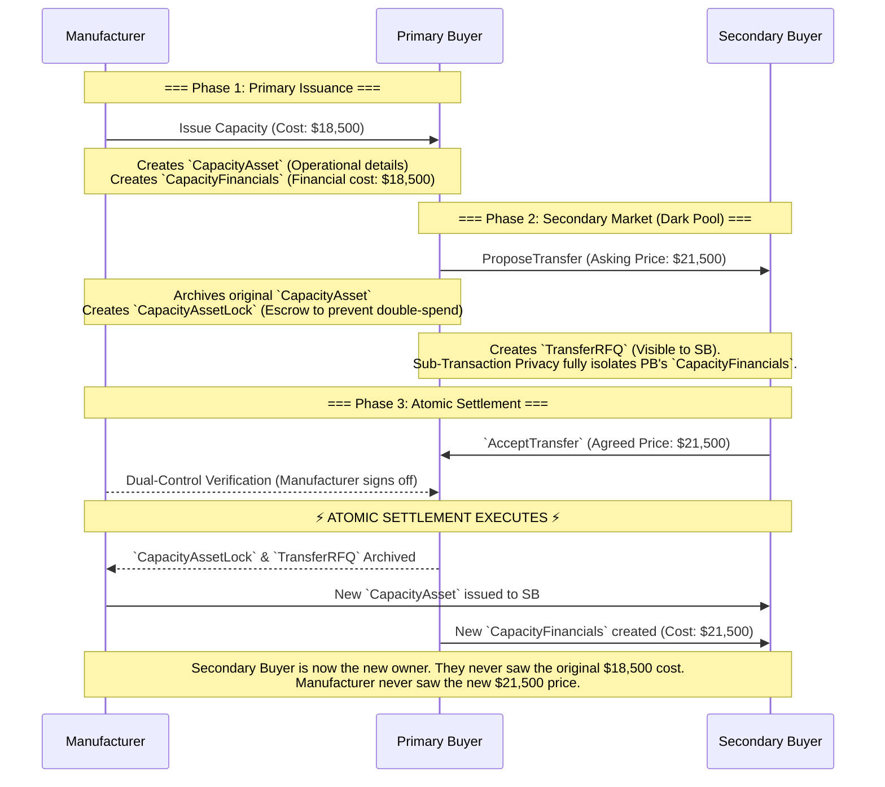

<div align="center">
  
  <h1>synCCap: Private DeFi & Capital Markets for Real-World Assets</h1>
</div>

> **Track Focus:** Private DeFi & Capital Markets, TradeFi, RWA & Tokenised Assets

**synCCap** is an institutional-grade decentralised application that tokenises the world's most strategic real-world asset (RWA): **High-End Semiconductor Foundry Capacity**. 

Built on the **Canton Network** using **Daml**, synCCap provides an OTC Dark Pool for secondary market trading of capacity commitments. It strictly enforces sub-transaction privacy to guarantee that highly sensitive commercial data—such as a primary buyer’s cost basis and penalty rates—are mathematically concealed from secondary buyers and market competitors.

---

## 🏗 Architecture & Design Rationale

This project is built using a modern Web3 stack, utilizing **Daml** on the **Canton Network** to achieve something impossible on public blockchains like Ethereum or Solana: **Sub-Transaction Privacy**.



### 🧠 The Privacy Design Pattern: Asset / Financial Decoupling
To create a true "Dark Pool," we must prevent Secondary Buyers from deducing the Primary Buyer's original cost basis. If we stored the price on the capacity token itself, transferring it would leak business intelligence.

Our solution is an **architectural decoupling** in our Daml smart contracts:
1. **The Physical Token**: Holds non-sensitive operational data (Wafer count, Node, Dates).
2. **The Financial Token**: Holds highly sensitive pricing data (Cost basis, Penalty rates).

When capacity is traded on the secondary market, the physical token is transferred, but the original financial token remains strictly bilateral and hidden. A *new* financial token is minted for the secondary buyer at the new agreed price. 

### 📜 Smart Contract Layer (`synccap-v5`)

Our Daml schema (`daml/SynCCap.daml`) defines five core templates to orchestrate this secure lifecycle:

*   **`CapacityAsset` (The RWA Token)**
    *   **Stores:** `manufacturer`, `owner`, `technologyNode`, `waferStartsPerMonth`, `commitmentDates`.
    *   **Privacy:** Signatories are only the Manufacturer and the current Owner. There is NO price data on this contract, and NO observers. It is invisible to the rest of the network.
*   **`CapacityFinancials` (The Pricing Layer)**
    *   **Stores:** `costBasisPerWafer`, `creditor`, `debtor`.
    *   **Privacy:** Strictly bilateral. If Primary Buyer buys from Manufacturer, only Primary Buyer and Manufacturer see this. If Secondary Buyer buys from Primary Buyer, a *new* contract is formed between Primary Buyer and Secondary Buyer. Secondary Buyer NEVER sees the Primary Buyer-Manufacturer contract.
*   **`TransferRFQ` (The Dark Pool Order Book)**
    *   **Stores:** The capacity details and the `askingPricePerWafer`. 
    *   **Privacy:** The `seller` and `manufacturer` are signatories. The `buyer` (competitor) is an `observer`. The buyer sees the asking price, but cannot traverse the ledger history to find the seller's original cost.
*   **`CapacityAssetLock` (The Escrow)**
    *   **Stores:** The original asset details safely while an RFQ is floating in the dark pool, preventing double-spending.
*   **`PenaltyAgreement` (The OTC Settlement)**
    *   **Stores:** `penaltyRate`, `penaltyAmount`, `cancellationReason`.
    *   **Privacy:** Strictly bilateral between the Manufacturer and the penalised party. Completely invisible to the dark pool.
*   **`RejectedTransferLog` & `WithdrawnTransferLog` (The Immutable Audit Trail)**
    *   **Stores:** Details of failed or canceled RFQs, including the `technologyNode` and original asking price.
    *   **Privacy:** Ensures that even if a trade falls through, an immutable, privacy-preserved audit log is maintained for compliance without exposing the underlying asset's root financial data.

### 🔄 Atomic Settlement Flow

Because Canton supports atomic composability, accepting a Dark Pool offer executes perfectly in a single sub-transaction:



---

## 🚀 How to Run the Stack (Local Sandbox)

You will need three terminal windows to run the complete stack locally.

### Step 0: Environment Setup
Before running the backend or frontend, you must configure your environment variables.
```bash
# In Terminal 1 (Root directory)
cp backend/.env.example backend/.env
cp frontend/.env.example frontend/.env
```
Open both `.env` files and fill in the required variables (like `DEVNET_NAMESPACE` and `DEVNET_CLIENT_SECRET`) if you plan to connect to the Devnet.

### Step 1: Start the Canton Ledger Sandbox
Run the Daml sandbox to simulate the Canton Network and expose the Ledger API on port 7575.
```bash
# In Terminal 1 (Root directory)
dpm build
dpm sandbox --json-api-port 7575 --dar .daml/dist/synccap-v5-0.1.0.dar
```

### Step 2: Start the Backend REST API
The backend acts as an integration layer, translating HTTP REST calls into Daml Ledger API commands.
```bash
# In Terminal 2
cd backend
npm install
npm run dev
```
*(The backend will start on `http://localhost:3000` by default. API Docs are available at `http://localhost:3000/swagger`)*

### Step 3: Start the React Frontend
Launch the UI to interact with the ledger.
```bash
# In Terminal 3
cd frontend
npm install
npm run dev
```
*(The frontend will start on `http://localhost:5173`. Open this URL in your browser.)*

---

## 🌐 How to Run the Stack (Devnet)

To connect the application to the FiveNorth Devnet, follow these steps:

### Step 1: Configure Environment Variables
In `backend/.env` and `frontend/.env`, ensure you have filled out the Devnet credentials:

**Backend `.env`**:
```env
DEVNET_CLIENT_ID=validator-devnet-m2m
DEVNET_CLIENT_SECRET=your_secret_here
DEVNET_TOKEN_URL=https://auth.sandbox.fivenorth.io/application/o/token/
DEVNET_NAMESPACE=your_devnet_namespace
```

**Frontend `.env`**:
```env
VITE_DEVNET_API_URL=https://ledger-api.validator.devnet.sandbox.fivenorth.io
VITE_DEVNET_NAMESPACE=your_devnet_namespace
```

### Step 2: Upload Smart Contracts
Upload the compiled `.daml/dist/synccap-v5-0.1.0.dar` file to your participant node on the Devnet.

### Step 3: Start the Application
Run the backend and frontend exactly as you would in local development. 
```bash
# Terminal 1
cd backend && npm run dev

# Terminal 2
cd frontend && npm run dev
```

**Connecting to Devnet**: 
The application dynamically supports both networks! When you open the frontend, simply use the **Network Toggle** in the top-right corner to switch from "Local" to "Devnet". The application will automatically route requests to the Devnet APIs and handle the OAuth token generation for you.

---

## 🔒 The Privacy Guarantee

Why use Canton instead of a public chain (like Ethereum) or a standard database?
1. **Public Chains leak Business Intelligence (BI):** If Primary Buyer resells capacity to Secondary Buyer on Ethereum, Secondary Buyer can see exactly how much Primary Buyer originally paid Manufacturer. This is unacceptable for enterprise supply chains.
2. **Centralised DBs lack Trustless Settlement:** A standard database requires all parties to trust the DB operator. Canton provides atomic, trustless cryptographic settlement without a centralised intermediary.
3. **Canton's Solution:** Canton allows Primary Buyer to prove to Secondary Buyer that the asset is valid and the transfer is authorized, *without* revealing the original `costBasisPerWafer` to Secondary Buyer.

---

## 📄 License
This project is licensed under the Apache 2.0 License.
